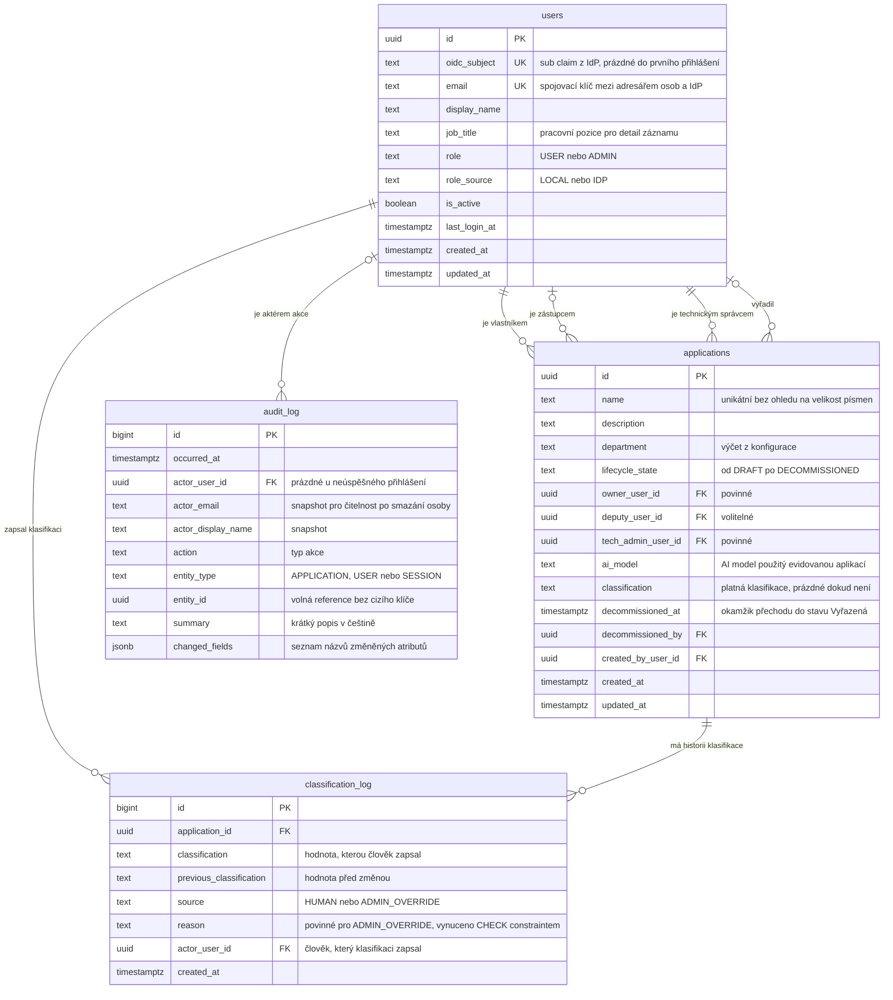

# Návrh databáze — jádro evidence

## Účel dokumentu

Datový model pro `requirements.md` této specifikace. Čtyři tabulky, žádná z nich nesouvisí s jazykovým modelem.

Sekce 9 popisuje, jak schéma rozšíří navazující specifikace `classification-advisor`. To rozšíření je čistě aditivní — žádný existující sloupec nemění význam a žádná data se nemigrují.

**Není v rozsahu:** volba ORM, migrační nástroj, konkrétní SQL DDL, API endpointy.

---

## 0. Volba databáze: PostgreSQL

**Rozhodnutí:** PostgreSQL jako samostatná služba v `docker-compose.yaml`, s healthcheckem a **bez publikovaného portu** na hostitele.

**Proč ne SQLite,** i když by byl provozně jednodušší:

| Důvod | Dopad |
|---|---|
| Jeden writer na celou databázi | `audit_log` je zápisově nejaktivnější tabulka a plní se ze všech souběžných sezení. Je to jediné místo, kde by zamykání reálně kouslo |
| Cizí klíče vypnuté ve výchozím stavu | `PRAGMA foreign_keys = ON` se musí nastavit na každém spojení. Celý model stojí na tom, že integritu drží databáze — nechci ji postavit na pragmě, kterou lze zapomenout |
| Žádný typ pro čas s časovou zónou | Retenční lhůty a auditní záznamy by běžely na textech, kde disciplínu drží jen aplikační kód |

**Co jsme si tím nezhoršili.** Nejsilnější argument pro PostgreSQL — `jsonb` u seznamu frameworků — padl s vypuštěním volitelných metadat. SQLite by částečné indexy i indexy nad výrazem zvládl. Rozhodnutí tedy nestojí na funkcích, ale na tvaru úložiště pro víceuživatelskou auditovanou evidenci.

**Jak snížit riziko, že to u hodnotitele nenaběhne.** „Běží to na první pokus" je hodnocená položka a dvě služby jsou vždy rizikovější než jedna:

- healthcheck na databázi plus `depends_on: condition: service_healthy`, aby aplikace nestartovala dřív
- **port databáze se nepublikuje** — potřebuje ji jen aplikace na interní síti compose. Tím zmizí nejčastější příčina selhání u cizího člověka, obsazený port 5432
- schéma se vytváří automaticky při startu, bez ručního migračního kroku *(R12.8)*
- pojmenovaný volume, aby data přežila restart

---

## 1. Principy návrhu

1. **Databáze nikdy nedrží ověřovací materiál.** Žádná hesla, hashe ani tokeny. Identita patří poskytovateli identity. *(R1.2)*
2. **Autorizace se rozhoduje podle identity, ne podle textu.** Odpovědné osoby jsou cizí klíče na `users`, ne jména jako volný text. Bez toho nelze pravidlo „edituj jen svůj záznam" vynutit. *(R2.6)*
3. **Nic se fyzicky nemaže, kromě retence.** Uživatelské akce jen přidávají řádky nebo nastavují časovou značku. *(R5.11, R8.5, R9.3)*
4. **Aktuální hodnota je na záznamu, historie je v logu.** Jaká klasifikace platí, je atribut aplikace. Kdo a proč ji zapsal, je log.
5. **Databáze drží strojové kódy, ne české texty.** Ve sloupcích jsou hodnoty jako `LARGE`. České popisky vznikají v kódu při vykreslení.
6. **Kde to jde, vynucuje pravidlo databáze.** Povinný důvod u přepisu správcem je `CHECK` constraint, ne konvence.

---

## 2. ER diagram

---

## 3. `users` — adresář osob a lokální role

**K čemu je.** Osoby, se kterými registr pracuje: přihlášení uživatelé i osoby uvedené jako vlastník, zástupce nebo technický správce. Nese aplikační roli.

**Proč existuje, když identita patří poskytovateli.** Zadání zakazuje vlastní tabulku uživatelů *a hesel*. Zákaz míří na správu přihlašovacích údajů, ne na evidenci osob. Tabulku potřebujeme ze dvou důvodů:

1. **Autorizace.** Pravidlo „uživatel edituje jen záznam, kde je členem odpovědné trojice" *(R2.6)* vyžaduje porovnání identit. Kdyby byl vlastník jen text `"Elena Rostová"`, autorizace by porovnávala jména — nespolehlivé a triviálně obejitelné.
2. **Přiřazení osoby, která se dosud nepřihlásila.** Nový záznam musí uvést technického správce i tehdy, když do registru nikdy nevstoupil *(R11.7)*.

**Párování s poskytovatelem identity.** `oidc_subject` je zpočátku prázdný. Při prvním přihlášení se hledá řádek podle `email` z claimu:

- shoda nalezena → doplní se `oidc_subject` a řádek je nadále svázaný se subjektem, ne s e-mailem
- shoda nenalezena → vznikne nový řádek s rolí `USER`

Po prvním přihlášení se identita drží na `oidc_subject`, aby změna e-mailu v poskytovateli uživatele neodpojila.

**Pravidla.**

- Nikdy neobsahuje heslo, hash ani token *(R1.2)*
- `role` je `USER` nebo `ADMIN`, výchozí `USER` *(R2.4)*
- `role_source` rozlišuje, zda role přišla z claimu, nebo byla nastavena lokálně. Při reálném poskytovateli má claim přednost *(R11.6)*
- Správce si nemůže odebrat vlastní roli a v systému musí zůstat alespoň jeden správce. Kontrola probíhá v transakci před zápisem *(R11.5)*
- Osobu nelze smazat, dokud je uvedena v některé odpovědné trojici *(R9.7)*
- `job_title` napájí zobrazení pozice u odpovědné trojice na detailu *(R4.3)*

---

## 4. `applications` — jádro registru

**K čemu je.** Jeden řádek = jedna evidovaná interní aplikace.

**Skupiny sloupců.**

| Skupina | Sloupce | Povinnost |
|---|---|---|
| Identifikace | `name`, `description`, `department` | název a útvar povinné |
| Odpovědnost | `owner_user_id`, `deputy_user_id`, `tech_admin_user_id` | vlastník a technický správce povinní |
| Životní cyklus | `lifecycle_state`, `decommissioned_at`, `decommissioned_by` | stav povinný, zbytek prázdný dokud není vyřazeno |
| AI | `ai_model` | volitelné |
| Klasifikace | `classification` | volitelné, prázdné dokud není klasifikováno |

Tabulka má **patnáct sloupců**. Blok volitelných metadat z mocku — citlivost dat, hosting, frameworky, cíl dostupnosti — je vědomě odložený. Zadání ho nežádá a jeho pozdější přidání je jen několik nullable sloupců, bez migrace dat.

**Proč je klasifikace jediný sloupec.** Tabulka má popisovat aplikaci, ne proces klasifikace. Zůstává proto jen **platná hodnota**. Kdo ji zapsal, kdy, jaká byla předchozí a proč ji správce změnil — to je v `classification_log`.

**Proč ten sloupec vůbec zůstává.** Výpis registru podle klasifikace filtruje, řadí a zobrazuje ji jako badge *(R3.1, R3.3)*. Kdyby platná hodnota žila jen v logu, každá stránka výpisu by musela najít nejnovější řádek pro každou aplikaci. Denormalizace to mění na obyčejný `WHERE`.

**Cena té denormalizace.** Vzniká invariant, který drží aplikace: *každý zápis do `classification_log` a odpovídající aktualizace `applications.classification` probíhá v jedné transakci*. Nikde jinde se ten sloupec nemění. Alternativou by byl databázový trigger — odolnější proti chybě v kódu, ale hůř testovatelný a schovává logiku mimo aplikaci.

**Význam sloupce `ai_model`.** Popisuje, jaký AI model používá **evidovaná aplikace**, ne náš registr. Je to atribut evidence vyžadovaný zadáním a s klasifikačním poradcem nemá nic společného. Zůstává proto i v této specifikaci.

**Vyřazení je jediný koncept pro odchod z registru.** Návrh dřív rozlišoval vyřazení aplikace od archivace záznamu. To byly dva koncepty pro jednu věc a jsou sloučené: `lifecycle_state = DECOMMISSIONED` znamená, že aplikace neběží, záznam je skrytý z výchozího výpisu a od `decommissioned_at` mu běží retenční lhůta.

**Proč vůbec vlastní sloupec s časem.** Retence musí počítat od okamžiku vyřazení *(R9.4)*. Nelze použít `updated_at`, protože jakákoli pozdější editace by lhůtu resetovala. Stav sám o sobě datum nenese, proto `decommissioned_at`.

**Kdo smí vyřadit.** Pouze Role_Admin *(R5.12)*. Kdyby to směl člen odpovědné trojice, mohl by u vlastního záznamu sám nastartovat jeho budoucí smazání. Vyřazení z registru je governance rozhodnutí, ne běžná editace. Je to zároveň důvod, proč zůstává v capability matrix jako právo odlišující obě role.

**Návrat z vyřazení.** Když se stav změní zpět, `decommissioned_at` se vyprázdní *(R5.14)*. Retenční lhůta pak začne znovu až při dalším vyřazení.

**Pravidla.**

- Povinné: `name`, `owner_user_id`, `tech_admin_user_id`, `department`, `lifecycle_state` *(R5.2)*
- `name` unikátní bez ohledu na velikost písmen *(R5.8)*
- Výchozí výpis filtruje `lifecycle_state <> 'DECOMMISSIONED'` *(R3.9)*
- `decommissioned_at` je vyplněné právě tehdy, když `lifecycle_state = 'DECOMMISSIONED'` — vynuceno `CHECK` constraintem
- Žádná uživatelská akce řádek nemaže *(R5.11)*

---

## 5. `classification_log` — kdo klasifikaci zapsal a proč

**K čemu je.** Nemazatelná historie zápisů klasifikace. Každý zápis je jeden řádek, i když jde o pouhou opravu.

**Pravidla podle `source`.**

| `source` | `reason` | Kdo smí zapsat |
|---|---|---|
| `HUMAN` | nepovinné | Člen odpovědné trojice nebo Role_Admin |
| `ADMIN_OVERRIDE` | **povinné a neprázdné** | Pouze Role_Admin |

Tato tabulka není jen dokumentace — povinný důvod je `CHECK` constraint ve smyslu *„buď to není `ADMIN_OVERRIDE`, nebo je důvod neprázdný"*. Pravidlo drží i při zápisu mimo aplikaci, například při ručním opravném SQL. Kontrola jen v aplikaci by požadavek R7.2 naplnila, ale constraint je silnější garance.

**Proč není důvod přepisu v `audit_log`.** Důvod je **business data**, ne dohledová metadata. Detail záznamu ho má zobrazit *(R4.7, R7.5)*. Kdyby byl v textovém popisu auditního záznamu, znamenalo by to parsovat větu, aby se vykreslila komponenta.

Vztah je takový: `classification_log` je zdroj pro **zobrazení a business logiku**, `audit_log` je zdroj pro **dohled**. Přepis vytvoří řádek v obou *(R7.7)*.

**Proč je historie klasifikace vlastní tabulka a ne jen auditní záznamy.** Historii klasifikace zobrazujeme uživatelům na detailu *(R6.6)*, zatímco auditní log vidí jen Role_Admin *(R8.4)*. Kdyby historie klasifikace žila jen v auditu, běžný uživatel by neviděl vývoj vlastního záznamu.

---

## 6. `audit_log` — kdo co udělal

**K čemu je.** Chronologický přírůstkový záznam akcí: přihlášení, odhlášení, vznik a změna záznamu, zápis a přepis klasifikace, vyřazení, změna role a **zamítnuté pokusy o neoprávněnou akci** *(R8.1)*.

**Snapshot aktéra.** Kromě `actor_user_id` se ukládá i `actor_email` a `actor_display_name` jako kopie v okamžiku akce *(R8.3)*. Záznam tak zůstane čitelný, i kdyby osoba později z adresáře zmizela nebo si změnila jméno. Audit má vypovídat o stavu v čase akce.

**`entity_id` bez cizího klíče.** Vědomá výjimka z relační integrity. Kdyby byl skutečným cizím klíčem na `applications`, retenční mazání vyřazeného záznamu by muselo smazat i jeho auditní historii, nebo by mazání zablokovalo. Audit musí přežít zmizení objektu, o kterém vypovídá *(R9.7)*.

**`changed_fields` obsahuje názvy, ne hodnoty.** Požadavek R5.9 chce vědět, které atributy se změnily. Ukládání starých a nových hodnot by do auditu vtáhlo osobní údaje z odpovědné trojice, což jde proti R12.10. Změny klasifikace, kde na hodnotách záleží, jsou navíc plně v `classification_log` včetně `previous_classification`.

**Co se neukládá vůbec.** Žádná IP adresa ani user agent *(R8.6)*. Jsou to osobní údaje ve smyslu GDPR a žádný požadavek je nepotřebuje.

**Nemazatelnost.** Aplikace nikdy nevydá `UPDATE` ani `DELETE` nad touto tabulkou *(R8.5)*. Jediná výjimka je retenční rutina. Volitelně lze doplnit trigger, který `UPDATE` odmítne — malá práce s velkým důkazním efektem.

---

## 7. Výčtové hodnoty

V databázi strojové kódy, v rozhraní české popisky. Mapování je v kódu.

| Sloupec | Hodnoty | České popisky |
|---|---|---|
| `users.role` | `USER`, `ADMIN` | Uživatel, Správce |
| `users.role_source` | `LOCAL`, `IDP` | — |
| `applications.lifecycle_state` | `DRAFT`, `IN_DEVELOPMENT`, `TESTING`, `IN_PRODUCTION`, `DECOMMISSIONED` | Návrh, Ve vývoji, Testování, Produkce, Vyřazená |
| `applications.classification` | `SMALL`, `MEDIUM`, `LARGE` | MALÁ, STŘEDNÍ, VELKÁ |
| `applications.department` | výčet z konfigurace | dle konfigurace |
| `classification_log.source` | `HUMAN`, `ADMIN_OVERRIDE` | Zadáno člověkem, Přepsáno správcem |
| `audit_log.action` | `SIGN_IN`, `SIGN_OUT`, `APP_CREATED`, `APP_UPDATED`, `APP_DECOMMISSIONED`, `APP_REACTIVATED`, `CLASSIFICATION_SET`, `CLASSIFICATION_OVERRIDDEN`, `ROLE_CHANGED`, `ACCESS_DENIED` | — |

**Proč ne české hodnoty v databázi.** Statický prototyp ukládal `'MALÁ'` a `'Produkce'` přímo. Pro provozní verzi to nechci: diakritika ve výčtových hodnotách přináší problémy s kódováním v exportech CSV a v parametrech URL u filtrů, a míchá datovou vrstvu s prezentační. Změna popisku by byla migrace dat.

**Proč `department` není tabulka.** Uzavřený výčet v konfiguraci, ne editovatelný registr. Validace je v aplikaci proti seznamu z konfigurace, aby přidání útvaru nevyžadovalo migraci.

---

## 8. Co v databázi vědomě není

| Neexistuje | Důvod |
|---|---|
| Tabulka hesel nebo tokenů | Ověřování patří poskytovateli identity. Absence sloupce je silnější garance než pravidlo v kódu *(R1.2)* |
| Tabulka sessions | Session je podepsaná httpOnly cookie. Databázové úložiště by přineslo úklid expirovaných řádků bez přínosu pro jednu instanci |
| Cokoli o jazykovém modelu | Není v rozsahu této specifikace. Doplní `classification-advisor` |
| Tabulka útvarů | Uzavřený výčet v konfiguraci |
| IP adresy a user agent v auditu | Osobní údaje bez opory v požadavcích *(R8.6)* |
| Tabulka běhů retence | Retence zapisuje do aplikačního logu *(R9.4)*. Pro jednu rutinu je vlastní tabulka zbytečná struktura |
| Verzovaný snapshot každé změny záznamu | `audit_log` říká, co se změnilo, `classification_log` drží plnou historii klasifikace |
| Fyzické mazání aplikací uživatelem | Registr je evidence. Odstranění je vyřazení *(R5.11)*. Fyzicky maže jen retenční rutina |
| Sloupce pro citlivost dat a technická metadata | Odloženo. Pocházejí z mocku, ne ze zadání. Doplnění je několik nullable sloupců bez migrace dat |

---

## 9. Jak schéma rozšíří `classification-advisor`

Rozšíření je čistě aditivní. Žádný existující sloupec nemění význam, žádná data se nemigrují.

| Změna | Typ |
|---|---|
| Nová tabulka `classification_suggestions` | přidání |
| Nová tabulka `llm_call_log` | přidání |
| Nový nepovinný sloupec `classification_log.suggestion_id` | přidání nullable sloupce |
| Rozšíření výčtu `classification_log.source` o `AI` a `AI_OVERRIDDEN` | rozšíření výčtu |
| Nové akce v `audit_log.action` pro vyžádání doporučení | rozšíření výčtu |

**Proč to takhle vyjde.** Existující řádky mají `suggestion_id` prázdné a `source` v hodnotách `HUMAN` nebo `ADMIN_OVERRIDE`, což po rozšíření zůstává platné. Záznamy klasifikované před nasazením poradce se nijak neliší od záznamů klasifikovaných ručně po jeho nasazení — protože to jsou tytéž případy.

**Co z toho plyne pro jádro.** Nesmí vzniknout žádný sloupec ani constraint, který by předpokládal existenci poradce. Constraint na `source` je proto formulovaný jako výčet povolených hodnot, který lze rozšířit, ne jako pravidlo vylučující cokoli jiného.

---

## 10. Chování cizích klíčů při retenčním mazání

Retence je jediný proces, který maže.

| Vazba | Chování | Důvod |
|---|---|---|
| `classification_log.application_id` | `ON DELETE CASCADE` | Historie klasifikace bez záznamu nemá výpovědní hodnotu *(R9.7)* |
| `audit_log.entity_id` | bez cizího klíče | Audit musí přežít zmizení objektu *(R9.7)* |
| `applications.owner_user_id` a další vazby na osoby | `ON DELETE RESTRICT` | Osobu nelze smazat, dokud je někde uvedena jako odpovědná *(R9.8)* |
| `classification_log.actor_user_id` | `ON DELETE RESTRICT` | Autorství zápisu musí zůstat dohledatelné |

---

## 11. Retenční politika v datech

| Kategorie | Tabulka | Sloupec pro výpočet hranice | Proměnná prostředí |
|---|---|---|---|
| Auditní záznamy | `audit_log` | `occurred_at` | `RETENTION_AUDIT_LOG_DAYS` |
| Vyřazené záznamy aplikací | `applications` | `decommissioned_at` | `RETENTION_DECOMMISSIONED_APP_DAYS` |

Každý běh zapíše do aplikačního logu kategorii, hranici a počet smazaných řádků *(R9.4)*. Rutina je automatická, bez ručního kroku *(R9.3)*.

---

## 12. Indexy

Registr o stovkách záznamů index nepotřebuje. Uvádím je proto, že určují způsob dotazování, a protože stránkování a filtrování běží na backendu *(R3.6)*.

**`applications`**

- částečný index na `lifecycle_state <> 'DECOMMISSIONED'` — výchozí výpis
- `decommissioned_at` — retenční rutina
- unikátní index na `lower(name)` — zamezení dvojích záznamů *(R5.8)*
- `lower(name)` pro vyhledávání bez ohledu na velikost písmen *(R3.2)*
- `department`, `classification`, `lifecycle_state` — filtry *(R3.3)*
- `owner_user_id`, `deputy_user_id`, `tech_admin_user_id` — kontrola oprávnění

**`classification_log`**: `(application_id, created_at DESC)` — historie na detailu a nalezení posledního zápisu

**`audit_log`**: `occurred_at DESC`, `(entity_type, entity_id)`, `actor_user_id`, `action` — filtry výpisu *(R8.7)*

**`users`**: unikátní `lower(email)`, unikátní `oidc_subject`

---

## 13. Klíčová rozhodnutí a jejich alternativy

| Rozhodnutí | Zvažovaná alternativa | Proč zvolené řešení |
|---|---|---|
| Odpovědná trojice jako cizí klíče na `users` | Jména jako volný text | Bez identity nelze vynutit „edituj jen svůj záznam". Text lze napsat jakkoli |
| Klasifikace jako jediný sloupec na `applications` | Sedm klasifikačních sloupců na záznamu | Tabulka má popisovat aplikaci, ne proces klasifikace |
| Ten jeden sloupec zůstává denormalizovaný | Zjišťovat platnou hodnotu vždy z logu | Výpis podle klasifikace filtruje a řadí. Poddotaz na každé stránce je zbytečná cena. Invariant je pojmenovaný a držený v jedné transakci |
| Vlastní `classification_log` mimo `audit_log` | Historii klasifikace odvozovat z auditu | Historii vidí běžný uživatel, audit jen správce. Důvod přepisu je business data zobrazovaná v rozhraní, ne text v popisu |
| Povinný důvod jako `CHECK` constraint | Kontrola jen v aplikaci | Nelze zapsat přepis bez důvodu ani ručním SQL |
| Výčet `source` formulovaný jako rozšiřitelný | Uzavřený výčet přesně na dvě hodnoty | Poradce doplní `AI` a `AI_OVERRIDDEN`. Rozšíření výčtu nesmí být breaking change |
| `audit_log.entity_id` bez cizího klíče | Cizí klíč s `ON DELETE SET NULL` | Audit musí přežít objekt. Cizí klíč by mazání blokoval nebo odkaz utrhl |
| Strojové kódy ve výčtech | České hodnoty přímo v databázi | Diakritika v exportech a URL, míchání datové a prezentační vrstvy, migrace při změně popisku |
| Jen stav `Vyřazená` plus `decommissioned_at` | Archivace jako samostatný koncept vedle stavu | Dva koncepty pro jednu věc. Časový sloupec je potřeba jen kvůli retenci, samotný stav datum nenese |
| Vyřazení vyhrazeno roli Admin | Vyřazení jako běžná změna stavu | Vyřazení startuje retenční lhůtu. Uživatel by tak mohl u vlastního záznamu nastartovat jeho smazání |
| PostgreSQL jako služba v compose | SQLite jako soubor | Viz sekce 0. Jeden writer, vypnuté cizí klíče a chybějící typ pro čas s časovou zónou jsou u auditované víceuživatelské evidence horší než jedna služba navíc |
| `bigint` u logových tabulek, `uuid` u business entit | `uuid` všude | Logy jsou přírůstkové a nikdy nejsou v adrese. Monotónní číslo dává levné řazení. `uuid` u business entit brání hádání identifikátorů v URL |

---

## 14. Trasovatelnost požadavků

| Požadavek | Kde se realizuje |
|---|---|
| R1 Autentizace | `users.oidc_subject`, `users.email`, absence sloupců s hesly |
| R2 Role a oprávnění | `users.role`, `users.role_source`, vazby odpovědné trojice na `applications` |
| R3 Seznam registru | Indexy nad `applications`, částečný index na nevyřazené záznamy, denormalizovaný sloupec `classification` |
| R4 Detail aplikace | `applications`, `job_title` z `users`, poslední řádek `classification_log` |
| R5 Vytvoření a editace | Povinné sloupce `applications`, unikátní `lower(name)`, `created_by_user_id`, `audit_log` |
| R6 Zápis klasifikace | `classification_log` se `source = HUMAN`, `applications.classification` |
| R7 Přepis správcem | `classification_log.reason` s `CHECK` constraintem, `source = ADMIN_OVERRIDE` |
| R8 Auditní log | `audit_log` se snapshotem aktéra a volnou referencí na entitu |
| R9 Retence | Sloupce pro výpočet hranice, chování cizích klíčů, zápis do aplikačního logu |
| R10 Export CSV | Bez vlastní struktury, čte se z existujících tabulek s aplikovanými filtry |
| R11 Správa uživatelů | `users.role`, `users.role_source`, `audit_log` s akcí `ROLE_CHANGED` |
| R12 Provoz | Automatické vytvoření schématu a naplnění syntetickými daty při prvním startu |
| R13 Rozhraní a jazyk | Mapování strojových kódů na české popisky v kódu, ne v databázi |
