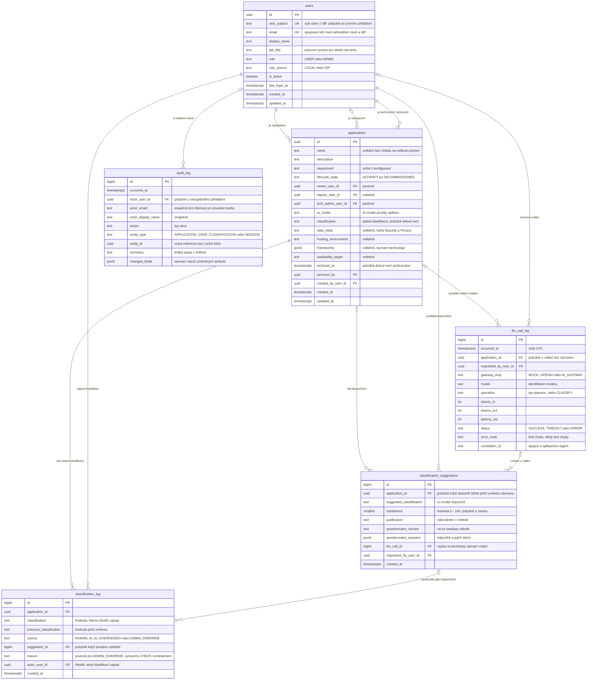

# Návrh databáze — Registr interních aplikací

> **NAHRAZENO.** Model byl rozdělen mezi `app-registry-core/database.md` (čtyři tabulky jádra) a budoucí `classification-advisor` (dvě tabulky poradce plus nepovinný cizí klíč).
>
> Dokument zůstává jako archiv úvah. Sekce 12 popisuje, proč z návrhu zmizel stavový automat klasifikace, hranice důvěry a fallback větev — to je materiál do README.
>
> **Závazný model je v implementačních specifikacích.**

## Účel dokumentu

Datový model odvozený z `requirements.md`. Popisuje, jaké tabulky existují, k čemu každá je, jaká pravidla drží a proč je návrh zvolený takto. Podklad pro `design.md` a zároveň materiál pro obhajobu — u každého netriviálního rozhodnutí je uvedena alternativa a důvod, proč nebyla zvolena.

**Není v rozsahu:** volba ORM, migrační nástroj, konkrétní SQL DDL, API endpointy.

---

## 1. Základní dělení: jádro a poradce

Model je rozdělený na dvě oblasti a to dělení je záměrné, ne kosmetické.

**Jádro evidence** je hlavní funkce aplikace. Funguje kompletně bez jediného volání jazykového modelu. Eviduje aplikace, jejich odpovědné osoby, stav a klasifikaci.

| Tabulka | Role |
|---|---|
| `users` | Adresář osob a aplikační role |
| `applications` | Evidované aplikace |
| `classification_log` | Historie změn klasifikace |
| `audit_log` | Dohledový záznam akcí |

**Klasifikační poradce** je připojený modul. Doporučuje klasifikaci na základě odpovědí v dotazníku a své doporučení zdůvodní.

| Tabulka | Role |
|---|---|
| `classification_suggestions` | Doporučení modelu, jeho zdůvodnění a odpovědi z dotazníku |
| `llm_call_log` | Technický záznam volání modelu |

**Jediná vazba mezi oblastmi** je nepovinný cizí klíč `classification_log.suggestion_id`. Když poradce vypneme, jádro se nezmění — jen ten sloupec zůstane prázdný. Tvrzení „registr funguje bez AI" je tak vynucené strukturou, ne jen slibem v dokumentaci.

### Ústřední pravidlo

> **Klasifikaci vždy zapisuje člověk. Model ji nikdy nezapisuje, pouze doporučuje.**

Z toho plynou tři podporované postupy, které se liší jen hodnotou `classification_log.source`:

| Postup | `source` | Co se stalo |
|---|---|---|
| Vyplním sám | `HUMAN` | Člověk zvolil úroveň bez doporučení. Poradce neběžel |
| Nechám si doporučit a přijmu | `AI` | Člověk přijal doporučení modelu bez úpravy |
| Nechám si doporučit a změním | `AI_OVERRIDDEN` | Člověk doporučení viděl a zvolil jinou úroveň |
| Admin zasáhne do cizího záznamu | `ADMIN_OVERRIDE` | Správce změnil klasifikaci s povinným důvodem |

Toto pravidlo odstraňuje z modelu tři věci, které byly v první verzi návrhu: stavový automat klasifikace, konfigurovatelnou hranici důvěry a samostatnou fallback větev. Podrobně v sekci 12.

---

## 2. Principy návrhu

1. **Databáze nikdy nedrží ověřovací materiál.** Žádná hesla, hashe ani tokeny. Identita patří poskytovateli identity. *(R1.2)*
2. **Obsah promptu ani odpovědi modelu se do databáze nedostane.** Není to pravidlo v kódu — takový sloupec ve schématu neexistuje, takže ho nelze omylem naplnit. *(R10.2)*
3. **Autorizace se rozhoduje podle identity, ne podle textu.** Odpovědné osoby jsou cizí klíče na `users`, ne jména jako volný text. *(R2, R5.8)*
4. **Nic se fyzicky nemaže, kromě retence.** Uživatelské akce jen přidávají řádky nebo nastavují časovou značku. *(R5.9, R12.4, R13.3)*
5. **Aktuální hodnota je na záznamu, historie je v logu.** Jaká klasifikace platí, je atribut aplikace. Jak a proč k ní člověk došel, je log.
6. **Databáze drží strojové kódy, ne české texty.** Ve sloupcích jsou hodnoty jako `LARGE`. České popisky vznikají v kódu při vykreslení.
7. **Kde to jde, vynucuje pravidlo databáze.** Povinný důvod u přepisu i konzistence příznaku `source` jsou `CHECK` constrainty, ne konvence.

---

## 3. ER diagram

---

## 4. Jádro evidence

### 4.1 `users` — adresář osob a lokální role

**K čemu je.** Osoby, se kterými registr pracuje: přihlášení uživatelé i osoby uvedené jako vlastník, zástupce nebo technický správce. Nese aplikační roli.

**Proč existuje, když identita patří poskytovateli.** Zadání zakazuje vlastní tabulku uživatelů *a hesel*. Zákaz míří na správu přihlašovacích údajů, ne na evidenci osob. Tabulku potřebujeme ze dvou důvodů:

1. **Autorizace.** Pravidlo „uživatel edituje jen záznam, kde je členem odpovědné trojice" vyžaduje porovnání identit. Kdyby byl vlastník jen text `"Elena Rostová"`, autorizace by porovnávala jména — nespolehlivé a triviálně obejitelné.
2. **Přiřazení osoby, která se dosud nepřihlásila.** Nový záznam musí uvést technického správce i tehdy, když do registru nikdy nevstoupil.

**Párování s poskytovatelem identity.** `oidc_subject` je zpočátku prázdný. Při prvním přihlášení se hledá řádek podle `email` z claimu:

- shoda nalezena → doplní se `oidc_subject` a řádek je nadále svázaný se subjektem, ne s e-mailem
- shoda nenalezena → vznikne nový řádek s rolí `USER`

Po prvním přihlášení se identita drží na `oidc_subject`, aby změna e-mailu v poskytovateli uživatele neodpojila.

**Pravidla.**

- Nikdy neobsahuje heslo, hash ani token *(R1.2)*
- `role` je `USER` nebo `ADMIN`, výchozí `USER` *(R2.4)*
- `role_source` rozlišuje, zda role přišla z claimu, nebo byla nastavena lokálně. Při reálném poskytovateli má claim přednost *(R15.6)*
- Správce si nemůže odebrat vlastní roli a v systému musí zůstat alespoň jeden správce. Kontrola probíhá v transakci před zápisem *(R15.5)*
- `job_title` napájí zobrazení pozice u odpovědné trojice na detailu *(R4.3)*

---

### 4.2 `applications` — jádro registru

**K čemu je.** Jeden řádek = jedna evidovaná interní aplikace.

**Skupiny sloupců.**

| Skupina | Sloupce | Povinnost |
|---|---|---|
| Identifikace | `name`, `description`, `department` | název a útvar povinné |
| Odpovědnost | `owner_user_id`, `deputy_user_id`, `tech_admin_user_id` | vlastník a technický správce povinní |
| Životní cyklus | `lifecycle_state`, `archived_at`, `archived_by` | stav povinný |
| AI | `ai_model` | volitelné |
| Klasifikace | `classification` | volitelné, prázdné dokud není klasifikováno |
| Volitelná metadata | `data_class`, `hosting_environment`, `frameworks`, `availability_target` | vše volitelné |

**Proč je klasifikace jediný sloupec.** První verze návrhu měla na této tabulce sedm klasifikačních sloupců: úroveň, stav, zdůvodnění, důvěru, zdroj, kdy a kdo. Tabulka tím přestala popisovat aplikaci a začala popisovat proces klasifikace. Zůstává proto jen **platná hodnota**. Zdůvodnění, důvěra, odpovědi z dotazníku, důvod přepisu a autorství jsou v `classification_log` a `classification_suggestions`.

**Proč zůstává i ten jeden sloupec.** Výpis registru podle klasifikace filtruje, řadí a zobrazuje ji jako badge *(R3.1, R3.3)*. Kdyby platná hodnota žila jen v logu, každá stránka výpisu potřebuje najít nejnovější řádek pro každou aplikaci. Denormalizace to mění na obyčejný `WHERE`.

**Cena té denormalizace.** Vzniká invariant, který drží aplikace: *každý zápis do `classification_log` a odpovídající aktualizace `applications.classification` probíhá v jedné transakci*. Nikde jinde se ten sloupec nemění. Alternativou by byl databázový trigger — odolnější proti chybě v kódu, ale hůř testovatelný a schovává logiku mimo aplikaci.

**Volitelná metadata jsou první kandidát na vypuštění.** `data_class`, `hosting_environment`, `frameworks` a `availability_target` pocházejí z mocku, ne ze zadání. Zadání jmenuje název, vlastníka, zástupce, technického správce, klasifikaci, stav a AI model. Když se bude krátit rozsah, jde tenhle blok jako první a `applications` se scvrkne na patnáct sloupců.

**Archivace vs. stav `Vyřazená` — dvě různé věci.** V požadavcích to není propojené, proto to zde rozhoduji a označuji k potvrzení:

- `lifecycle_state = DECOMMISSIONED` je fakt o **aplikaci** — už neběží
- `archived_at` je fakt o **záznamu v registru** — je skrytý z výchozího výpisu a začíná mu běžet retenční lhůta

Vyřazená aplikace tedy může mít stále aktivní záznam, protože se o ní ještě potřebujeme bavit. Archivace je vědomý krok správce, ne automatický důsledek vyřazení.

**Pravidla.**

- Povinné: `name`, `owner_user_id`, `tech_admin_user_id`, `department`, `lifecycle_state` *(R5.2)*
- `name` unikátní bez ohledu na velikost písmen, aby nevznikly dvojí záznamy o téže aplikaci
- Záznam smí vzniknout bez klasifikace; pak je `classification` prázdná *(R5.6)*
- Výchozí výpis filtruje `archived_at IS NULL` *(R3.9)*
- Žádná uživatelská akce řádek nemaže *(R5.9)*

---

### 4.3 `classification_log` — kdo klasifikaci zapsal a proč

**K čemu je.** Nemazatelná historie změn platné klasifikace. Každý zápis úrovně je jeden řádek, bez ohledu na to, jestli poradce běžel.

**Proč je součástí jádra, a ne poradce.** Klasifikaci lze zapsat i bez modelu. Log tedy musí existovat, i když poradce vůbec nenasadíme. Do poradce patří jen ta část, která popisuje doporučení — a ta žije ve `classification_suggestions`.

**Jak se pozná postup.** `source` nese jednu ze čtyř hodnot popsaných v sekci 1. Vazba na doporučení je nepovinná a její přítomnost musí odpovídat příznaku:

| `source` | `suggestion_id` | `reason` |
|---|---|---|
| `HUMAN` | musí být prázdné | nepovinné |
| `AI` | musí být vyplněné | nepovinné |
| `AI_OVERRIDDEN` | musí být vyplněné | nepovinné |
| `ADMIN_OVERRIDE` | nepovinné | **povinné a neprázdné** |

Tato tabulka není jen dokumentace — je to sada `CHECK` constraintů. Nelze zapsat řádek se `source = HUMAN`, který se odkazuje na doporučení modelu, ani přepis správce bez důvodu. Pravidlo drží i při zápisu mimo aplikaci, například při ručním opravném SQL.

**Rozdíl mezi `AI` a `AI_OVERRIDDEN`.** U `AI` se `classification` rovná `suggested_classification` z navázaného doporučení. U `AI_OVERRIDDEN` se liší. Tento vztah kříží dvě tabulky, takže ho `CHECK` constraint pokrýt nedokáže — hlídá ho aplikace při zápisu. Je to jediné klasifikační pravidlo, které databáze nevynucuje, a proto je zde výslovně jmenované.

**Proč důvod přepisu není v `audit_log`.** Důvod je **business data**, ne dohledová metadata. Detail záznamu má zobrazit „Přepsáno správcem, důvod: …" vedle původního doporučení. Kdyby důvod byl v textovém popisu auditního záznamu, znamenalo by to parsovat větu, aby se vykreslila komponenta. Vztah je takový: `classification_log` je zdroj pro **zobrazení a business logiku**, `audit_log` je zdroj pro **dohled**. Přepis vytvoří řádek v obou.

**Hromadný přepis.** Pokud v rozsahu zůstane, zapíše samostatný řádek pro každý záznam *(R8.8)*. Doplní se sloupec `bulk_operation_id`, který řádky jedné operace spojí. Zatím ho neuvádím, protože hromadná operace je v sekci vědomého dluhu jako kandidát na vypuštění.

---

### 4.4 `audit_log` — kdo co udělal

**K čemu je.** Chronologický přírůstkový záznam akcí: přihlášení, odhlášení, vznik a změna záznamu, zápis a přepis klasifikace, archivace a **zamítnuté pokusy o neoprávněnou akci** *(R12.1)*.

**Snapshot aktéra.** Kromě `actor_user_id` se ukládá i `actor_email` a `actor_display_name` jako kopie v okamžiku akce. Záznam tak zůstane čitelný, i kdyby osoba později z adresáře zmizela nebo si změnila jméno. Audit má vypovídat o stavu v čase akce.

**`entity_id` bez cizího klíče.** Vědomá výjimka z relační integrity. Kdyby byl skutečným cizím klíčem na `applications`, retenční mazání archivovaného záznamu by muselo smazat i jeho auditní historii, nebo by mazání zablokovalo. Audit musí přežít zmizení objektu, o kterém vypovídá.

**`changed_fields` obsahuje názvy, ne hodnoty.** Požadavek R5.7 chce vědět, které atributy se změnily. Ukládání starých a nových hodnot by do auditu vtáhlo osobní údaje z odpovědné trojice, což jde proti R16.9. Změny klasifikace, kde na hodnotách záleží, jsou navíc plně v `classification_log` včetně `previous_classification`.

**Co se neukládá vůbec.** Žádná IP adresa ani user agent. Jsou to osobní údaje ve smyslu GDPR a žádný požadavek je nepotřebuje.

**Nemazatelnost.** Aplikace nikdy nevydá `UPDATE` ani `DELETE` nad touto tabulkou *(R12.4)*. Jediná výjimka je retenční rutina *(R13.6)*. Volitelně lze doplnit trigger, který `UPDATE` odmítne — malá práce s velkým důkazním efektem.

---

## 5. Klasifikační poradce

### 5.1 `classification_suggestions` — co doporučil model

**K čemu je.** Nemazatelný záznam jednoho průchodu klasifikačním dotazníkem: odpovědi, doporučená úroveň, zdůvodnění a míra důvěry.

**Proč samostatná tabulka a ne sloupce v logu.** Kdyby doporučení bylo sadou nepovinných sloupců v `classification_log`, jádro by o modelu vědělo. Takhle je vazba jediný nepovinný cizí klíč. Vypnutí poradce znamená zahodit dvě tabulky a nechat ten klíč prázdný; jádro se nezmění. To je rozdíl mezi „AI je bonus" jako tvrzením a jako vlastností schématu.

**Doporučení není rozhodnutí.** Řádek zde vznikne, i když člověk doporučení nakonec nepoužije nebo formulář zavře. To je žádoucí: chceme vědět, kolik doporučení model vydal a kolik z nich lidé přijali. Poměr `source = AI` k počtu doporučení je použitelná metrika kvality.

**`application_id` je nepovinné.** Dotazník smí běžet dřív, než záznam existuje — výsledek se pak přenáší do formuláře *(R7.7)*. Doporučení proto vzniká i bez aplikace a přiváže se až při uložení.

**Proč jsou odpovědi v `jsonb`.** Katalog otázek je verzovaný kód, ne uživatelsky editovatelná data; otázky nelze zakládat v UI. Relační varianta s tabulkou otázek by vyžadovala migraci při každé změně formulace a řešení historických odkazů. `jsonb` plus `questionnaire_version` drží schéma stabilní a starý řádek zůstane interpretovatelný podle své verze. Cenou je, že se nad odpověďmi nedá pohodlně agregovat — což zatím žádný požadavek nechce.

**`confidence` může být prázdná.** Mock implementace poradce počítá úroveň bodově a žádnou míru důvěry nemá. Prázdná hodnota je pravdivější než vymyšlené číslo.

---

### 5.2 `llm_call_log` — technický záznam volání modelu

**K čemu je.** Jeden řádek za jedno volání jazykového modelu, včetně selhaných. Dohled nad náklady a spolehlivostí. Zadání ho vyžaduje výslovně: model, čas, tokeny.

**Co v tabulce záměrně není.** Neexistuje sloupec pro prompt, odpověď ani přepis *(R10.2)*. Není to kontrola v kódu — pole ve schématu chybí, takže ho nelze naplnit ani omylem.

**Proč `error_code` a ne `error_message`.** Chybové zprávy poskytovatelů běžně obsahují výňatek vstupu, který problém způsobil. Uložením textu chyby by se obsah promptu dostal do databáze zadními dvířky. Ukládá se proto jen kód.

**Směr vazby na doporučení.** Volání proběhne dřív, než doporučení vznikne, a u selhaného volání žádné doporučení nevznikne vůbec. Cizí klíč proto míří z `classification_suggestions` na `llm_call_log`, ne naopak. Vzniká tak i užitečná kontrola: řádek se `status = SUCCESS`, na který se žádné doporučení neodkazuje, znamená, že volání prošlo, ale odpověď se nepodařilo zpracovat.

**`gateway_impl`.** Zaznamenává, která implementace abstrakční vrstvy volání obsloužila — mock, veřejný poskytovatel, nebo firemní gateway. Doklad zaměnitelnosti *(R9.3)* přímo v datech, ne jen v kódu.

**`correlation_id`.** Spojuje řádek s aplikačním logem, aniž by se do databáze ukládalo cokoli o obsahu.

---

## 6. Výčtové hodnoty

V databázi strojové kódy, v rozhraní české popisky. Mapování je v kódu.

| Sloupec | Hodnoty | České popisky |
|---|---|---|
| `users.role` | `USER`, `ADMIN` | Uživatel, Správce |
| `users.role_source` | `LOCAL`, `IDP` | — |
| `applications.lifecycle_state` | `DRAFT`, `IN_DEVELOPMENT`, `TESTING`, `IN_PRODUCTION`, `DECOMMISSIONED` | Návrh, Ve vývoji, Testování, Produkce, Vyřazená |
| `applications.classification` | `SMALL`, `MEDIUM`, `LARGE` | MALÁ, STŘEDNÍ, VELKÁ |
| `applications.data_class` | `PUBLIC`, `INTERNAL_CONFIDENTIAL`, `PERSONAL_FINANCIAL` | Veřejná, Interní důvěrná, Osobní údaje a finanční data |
| `applications.department` | výčet z konfigurace | dle konfigurace |
| `classification_log.source` | `HUMAN`, `AI`, `AI_OVERRIDDEN`, `ADMIN_OVERRIDE` | Zadáno člověkem, Přijato doporučení, Doporučení změněno, Přepsáno správcem |
| `llm_call_log.status` | `SUCCESS`, `TIMEOUT`, `ERROR` | Úspěch, Timeout, Chyba |
| `llm_call_log.gateway_impl` | `MOCK`, `OPENAI`, `AI_GATEWAY` | — |
| `audit_log.action` | `SIGN_IN`, `SIGN_OUT`, `APP_CREATED`, `APP_UPDATED`, `APP_ARCHIVED`, `CLASSIFICATION_SET`, `CLASSIFICATION_OVERRIDDEN`, `ROLE_CHANGED`, `ACCESS_DENIED` | — |

**Proč ne české hodnoty v databázi.** Prototyp ukládal `'MALÁ'` a `'Produkce'` přímo. Pro provozní verzi to nechci: diakritika ve výčtových hodnotách přináší problémy s kódováním v exportech CSV a v parametrech URL u filtrů, a míchá datovou vrstvu s prezentační. Změna popisku by byla migrace dat.

**Proč `department` není tabulka.** Požadavky ho vědomě definují jako uzavřený výčet v konfiguraci, ne jako editovatelný registr. Validace je v aplikaci proti seznamu z konfigurace, aby přidání útvaru nevyžadovalo migraci.

---

## 7. Co v databázi vědomě není

Negativní rozhodnutí jsou u tohoto zadání hodnocená stejně jako pozitivní.

| Neexistuje | Důvod |
|---|---|
| Tabulka hesel nebo tokenů | Ověřování patří poskytovateli identity. Absence sloupce je silnější garance než pravidlo v kódu *(R1.2)* |
| Tabulka sessions | Session je podepsaná httpOnly cookie. Databázové úložiště by přineslo úklid expirovaných řádků bez přínosu pro jednu instanci |
| Stav klasifikace | Klasifikaci zapisuje výhradně člověk, takže není co schvalovat. Aplikace klasifikaci má, nebo nemá. Viz sekce 12 |
| Mapování zástupných symbolů pro anonymizaci | Mapování existuje jen v paměti po dobu zpracování požadavku. Jeho uložení by vytvořilo přesně to riziko, které má anonymizace odstranit *(R11.5)* |
| Obsah promptů a odpovědí modelu | Sloupec neexistuje, nelze ho naplnit *(R10.2)* |
| IP adresy a user agent v auditu | Osobní údaje bez opory v požadavcích *(R16.9)* |
| Tabulka útvarů | Uzavřený výčet v konfiguraci |
| Tabulka otázek dotazníku | Verzovaný katalog v kódu. Otázky nejsou uživatelský obsah |
| Tabulka běhů retence | Retence zapisuje do aplikačního logu. Vlastní tabulka byla v první verzi návrhu, ale pro jednu rutinu je to zbytečná struktura |
| Verzovaný snapshot každé změny záznamu | `audit_log` říká, co se změnilo, `classification_log` drží plnou historii klasifikace. Kompletní time-travel je nad rozsah |
| Fyzické mazání aplikací uživatelem | Registr je evidence. Odstranění je archivace *(R5.9)* |

---

## 8. Chování cizích klíčů při retenčním mazání

Retence je jediný proces, který maže. Tabulka určuje, co se stane při smazání archivovaného záznamu aplikace.

| Vazba | Chování | Důvod |
|---|---|---|
| `classification_log.application_id` | `ON DELETE CASCADE` | Historie klasifikace bez záznamu nemá výpovědní hodnotu |
| `classification_suggestions.application_id` | `ON DELETE SET NULL` | Doporučení zůstane jako podklad pro metriku kvality modelu. Neobsahuje osobní údaje |
| `classification_log.suggestion_id` | `ON DELETE SET NULL` | Log přežije úklid doporučení |
| `llm_call_log.application_id` | `ON DELETE SET NULL` | Metrika nákladů a latence má smysl i bez záznamu |
| `classification_suggestions.llm_call_id` | `ON DELETE SET NULL` | Doporučení přežije retenci technických logů, které jsou kratší |
| `audit_log.entity_id` | bez cizího klíče | Audit musí přežít zmizení objektu |
| vazby na osoby v `users` | `ON DELETE RESTRICT` | Osobu nelze smazat, dokud je někde uvedena jako odpovědná. Chrání integritu odpovědnosti |

---

## 9. Retenční politika v datech

| Kategorie | Tabulka | Sloupec pro výpočet hranice | Proměnná prostředí |
|---|---|---|---|
| Logy volání modelu | `llm_call_log` | `occurred_at` | `RETENTION_LLM_LOG_DAYS` |
| Auditní záznamy | `audit_log` | `occurred_at` | `RETENTION_AUDIT_LOG_DAYS` |
| Archivované záznamy aplikací | `applications` | `archived_at` | `RETENTION_ARCHIVED_APP_DAYS` |

Každý běh zapíše do aplikačního logu kategorii, hranici a počet smazaných řádků *(R13.4)*. Rutina je automatická, bez ručního kroku *(R13.3)*.

Konkrétní lhůty jsou otevřená otázka — viz sekce 13.

---

## 10. Indexy

Registr o stovkách záznamů index nepotřebuje. Uvádím je proto, že určují způsob dotazování, a protože stránkování a filtrování běží na backendu *(R3.6)*.

**`applications`**

- částečný index na `archived_at IS NULL` — výchozí výpis
- unikátní index na `lower(name)` — zamezení dvojích záznamů
- `lower(name)` pro vyhledávání bez ohledu na velikost písmen
- `department`, `classification`, `lifecycle_state` — filtry *(R3.3)*
- `owner_user_id`, `deputy_user_id`, `tech_admin_user_id` — kontrola oprávnění a výpis „moje aplikace"

**`classification_log`**: `(application_id, created_at DESC)` — historie a nalezení posledního zápisu

**`classification_suggestions`**: `(application_id, created_at DESC)`, `llm_call_id`

**`llm_call_log`**: `occurred_at DESC` pro výpis a retenci, `application_id`, `model` pro filtry *(R10.5)*

**`audit_log`**: `occurred_at DESC`, `(entity_type, entity_id)`, `actor_user_id`

---

## 11. Klíčová rozhodnutí a jejich alternativy

| Rozhodnutí | Zvažovaná alternativa | Proč zvolené řešení |
|---|---|---|
| Klasifikace jako jediný sloupec na `applications` | Sedm klasifikačních sloupců na záznamu | Tabulka má popisovat aplikaci, ne proces klasifikace. Proces patří do logu |
| Ten jeden sloupec vůbec zůstává | Zjišťovat platnou hodnotu vždy z logu | Výpis podle klasifikace filtruje a řadí. Poddotaz na každé stránce je zbytečná cena. Vzniklý invariant je pojmenovaný a držený v jedné transakci |
| Doporučení modelu ve vlastní tabulce | Nepovinné AI sloupce v `classification_log` | Jádro nesmí o modelu vědět. Nepovinný cizí klíč místo osmi nepovinných sloupců dělá z „AI je bonus" vlastnost schématu, ne tvrzení |
| Jeden log klasifikace se čtyřmi hodnotami `source` | Oddělené tabulky pro návrh a rozhodnutí | Původní dělení návrh vs. rozhodnutí vzniklo z předpokladu, že klasifikaci schvaluje proces. Když ji vždy zapisuje člověk, stačí jeden log |
| Odpovědná trojice jako cizí klíče | Jména jako volný text | Bez identity nelze vynutit „edituj jen svůj záznam". Text lze napsat jakkoli |
| Konzistence `source` jako `CHECK` constraint | Kontrola jen v aplikaci | Nelze zapsat `HUMAN` řádek odkazující na doporučení modelu ani přepis bez důvodu, ani ručním SQL |
| Důvod přepisu v `classification_log` | Pouze v popisu auditního záznamu | Důvod se zobrazuje v rozhraní. Parsovat ho z textové věty je křehké |
| Odpovědi dotazníku v `jsonb` | Relační tabulka odpovědí s vazbou na tabulku otázek | Otázky jsou verzovaný kód, ne uživatelská data. Relační varianta si vynucuje migraci při každé změně formulace |
| `audit_log.entity_id` bez cizího klíče | Cizí klíč s `ON DELETE SET NULL` | Audit musí přežít objekt. Cizí klíč by mazání blokoval nebo odkaz utrhl |
| Strojové kódy ve výčtech | České hodnoty přímo v databázi | Diakritika v exportech a URL, míchání datové a prezentační vrstvy, migrace při změně popisku |
| Archivace jako `archived_at` odděleně od stavu | Archivace jako šestá hodnota stavu | Vyřazení aplikace a skrytí záznamu jsou dvě různá rozhodnutí, každé s jiným aktérem |
| `bigint` u logových tabulek, `uuid` u business entit | `uuid` všude | Logy jsou přírůstkové a nikdy nejsou v adrese. Monotónní číslo dává levné řazení. `uuid` u business entit brání hádání identifikátorů v URL |
| Bez tabulky běhů retence | Vlastní tabulka `retention_run` | Pro jedinou rutinu je to zbytečná struktura. Aplikační log požadavek R13.4 naplní |

---

## 12. Co se zjednodušilo proti první verzi návrhu

První verze stavěla klasifikaci jako proces se schvalováním: model navrhne, systém posoudí důvěru, člověk potvrdí nebo zamítne, správce případně přepíše. To vedlo na sedm tabulek, stavový automat a konfigurovatelnou hranici důvěry.

Chyba byla v tom, že **jediná cesta ke klasifikaci vedla přes model**. Požadavek R5.1 klasifikaci ani neuváděl mezi editovatelnými atributy. Kdyby model neběžel, aplikaci nešlo klasifikovat vůbec — hlavní funkce registru by závisela na bonusu.

Přeformulování na „klasifikaci vždy zapisuje člověk, model jen doporučuje" odstranilo čtyři věci:

| Zmizelo | Proč to bylo potřeba | Proč už není |
|---|---|---|
| `classification_status` se čtyřmi stavy | Sledoval, v jaké fázi schvalování klasifikace je | Není co schvalovat. Klasifikace buď je zapsaná, nebo není |
| Hranice důvěry jako konfigurace | Rozhodovala, kdy smí návrh projít automaticky | Automaticky neprojde nikdy. Nízká důvěra je varování u doporučení, ne branka |
| Deterministický fallback jako samostatná větev | Držel AI cestu funkční při výpadku modelu | Bodový scorer se stal **mock implementací** abstrakční vrstvy. Tím současně plní požadavek na dvě zaměnitelné implementace, z nichž jedna funguje bez klíče a bez internetu *(R9.3, R9.6)* |
| Tabulky `classification_proposals` a `classification_decisions` | Oddělovaly návrh modelu od lidského rozhodnutí | Nahradil je jeden `classification_log` v jádře a `classification_suggestions` v poradci. Dělicí linie je teď jádro vs. poradce, ne návrh vs. rozhodnutí |

Model má šest tabulek místo sedmi, ale hlavní zisk není v počtu — je v tom, že jádro evidence je použitelné bez poradce.

---

## 13. Otevřené otázky

1. **Retenční lhůty.** Návrh: logy volání modelu 90 dní, auditní záznamy 365 dní, archivované záznamy 730 dní. Auditní lhůta je nejdelší kvůli dohledu, logy modelu nejkratší, protože jde o provozní metriku.
2. **Rozsah detekce osobních údajů.** E-mail a telefon jsou spolehlivě řešitelné regulárním výrazem, jména nikoli. Návrh: nedetekovat jména v obecném textu, ale nahrazovat konkrétní známé hodnoty odpovědné trojice, které aplikace zná ze svých dat. Deterministické, testovatelné, bez falešně negativních výsledků na hodnotách, o kterých víme.
3. **Archivace vs. stav `Vyřazená`.** Navrhuji oddělit, jak popisuje sekce 4.2. Potřebuji potvrzení, že je to zamýšlené chování.
4. **PostgreSQL, nebo SQLite?** Návrh: PostgreSQL jako služba v compose. Lépe odpovídá „reálně provozovatelné" a `jsonb` i částečné indexy jsou nativní. Cenou je jedna služba navíc při startu.
5. **Zůstává blok volitelných metadat?** `data_class`, `hosting_environment`, `frameworks`, `availability_target` pocházejí z mocku, ne ze zadání. Jsou první kandidát na vypuštění.
6. **Zůstává hromadný přepis klasifikace?** Pokud ano, doplní se `classification_log.bulk_operation_id`.
7. **Obsahuje `changed_fields` jen názvy polí, nebo i hodnoty?** Návrh: jen názvy, viz sekce 4.4.
8. **Má `applications.name` být unikátní?** Návrh: ano, bez ohledu na velikost písmen. Otázkou je, zda to nebude vadit u aplikací se shodným názvem v různých útvarech.

---

## 14. Trasovatelnost požadavků

| Požadavek | Kde se realizuje |
|---|---|
| R1 Autentizace | `users.oidc_subject`, `users.email`, absence sloupců s hesly |
| R2 Role a oprávnění | `users.role`, `users.role_source`, vazby odpovědné trojice na `applications` |
| R3 Seznam registru | Indexy nad `applications`, `archived_at`, denormalizovaný sloupec `classification` |
| R4 Detail aplikace | `applications`, `job_title` z `users`, `classification_log` s vazbou na doporučení |
| R5 Vytvoření a editace | Povinné sloupce `applications`, `created_by_user_id`, `audit_log` |
| R6 Dotazník a doporučení | `classification_suggestions` |
| R7 Zápis klasifikace člověkem | `classification_log.source`, `applications.classification` |
| R8 Přepis správcem | `classification_log.reason` s `CHECK` constraintem |
| R9 Abstrakční vrstva | `llm_call_log.gateway_impl` jako doklad zaměnitelnosti |
| R10 Log volání modelu | `llm_call_log`, absence sloupců pro obsah, `error_code` místo textu chyby |
| R11 Anonymizace | Vědomá absence tabulky pro mapování |
| R12 Auditní log | `audit_log` se snapshotem aktéra a volnou referencí na entitu |
| R13 Retence | Sloupce pro výpočet hranice, chování cizích klíčů, zápis do aplikačního logu |
| R14 Export CSV | Bez vlastní struktury, čte se z existujících tabulek s aplikovanými filtry |
| R15 Správa uživatelů | `users.role`, `users.role_source`, `audit_log` s akcí `ROLE_CHANGED` |
| R16 Provoz | Naplnění syntetickými daty při prvním startu |
| R17 Rozhraní a jazyk | Mapování strojových kódů na české popisky v kódu, ne v databázi |
